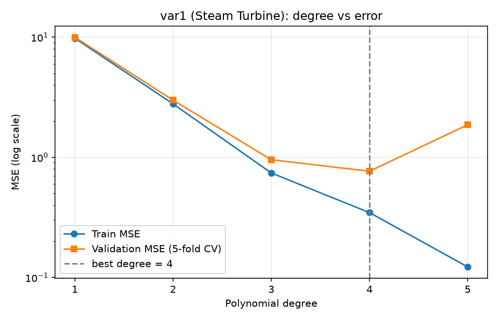
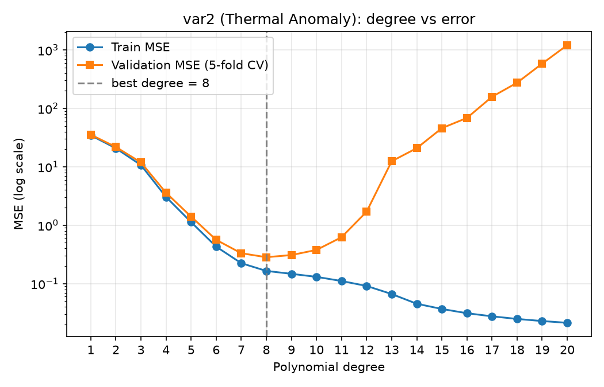

# Polynomial Regression from Scratch (Assignment 1)
**Student Name:** Jaswanth Gangavarapu  
**Roll Number:** BT2024010  

Multivariate polynomial regression implemented **from scratch** with `numpy` and `pandas`
(no scikit-learn). `matplotlib` is only used for plots.

- **var1** – Steam Turbine Net Power Score (6 features)
- **var2** – Geothermal Thermal Anomaly Score (3 features)

## Project structure

```
polynomial-regression-assignment/
├── data/
│   ├── BT2024010_train_var1.csv
│   ├── BT2024010_test_var1.csv
│   ├── BT2024010_train_var2.csv
│   ├── BT2024010_test_var2.csv
│   └── sample_submission.csv
├── outputs/
│   ├── BT2024010_pred_var1.csv      # submission file, problem 1
│   ├── BT2024010_pred_var2.csv      # submission file, problem 2
│   ├── degree_vs_error_var1.png
│   ├── degree_vs_error_var2.png
│   ├── cv_results_var1.csv          # full CV table per degree
│   └── cv_results_var2.csv
├── train_evaluate.py                # degree selection with 5-fold CV
├── predict_submission.py            # final fit + test predictions + sanity checks
├── .gitignore
├── requirements.txt
└── README.md
```

## Setup

```bash
python3 -m venv .venv
source .venv/bin/activate
pip install -r requirements.txt
```

## Usage

```bash
# 1. compare degrees (var1: 1-5, var2: 1-20) and save tables + plots to outputs/
python train_evaluate.py

# 2. refit on the full training set with the chosen degrees and write predictions
python predict_submission.py
```

## Method (short)

1. **Feature expansion** – all monomials whose powers sum to ≤ d, plus a bias column
   (`itertools.combinations_with_replacement`).
2. **Scaling** – z-score normalisation of the expanded features, using training statistics only.
3. **Model** – ridge normal equation `w = (XᵀX + λI')⁻¹ Xᵀy` (bias not penalised),
   solved with `np.linalg.lstsq`.
4. **Selection** – 5-fold cross-validation, choosing the degree with the lowest mean validation MSE.

## Results

| Problem | Degree | λ | CV Val MSE | CV Val R² |
|---|---|---|---|---|
| var1 | 4 | 1e-6 | 0.766 | 0.931 |
| var2 | 8 | 1e-6 | 0.283 | 0.994 |



